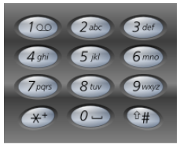
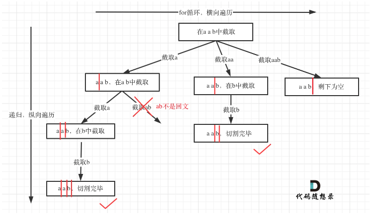

# 回溯算法

## 0 概述

**回溯的本质就是暴力搜索**，使用场景是通过迭代方法很难一次性暴力搜索完整的场景。

回溯法，一般可以解决如下几种问题：

- 组合问题：N个数里面按一定规则找出k个数的集合
- 切割问题：一个字符串按一定规则有几种切割方式
- 子集问题：一个N个数的集合里有多少符合条件的子集
- 排列问题：N个数按一定规则全排列，有几种排列方式
- 棋盘问题：N皇后，解数独等等

**回溯模板**

```cpp
void backTracking (参数) {
	if (终止条件) {
		存放结果;
		return;
	}
	
	for (单层递归参数) {
		处理节点;
		递归算法;
		回溯;
	}
	return;
}
```


## 77 组合

**题目：**

给定两个整数 `n` 和 `k`，返回范围 `[1, n]` 中所有可能的 `k` 个数的组合。

你可以按 **任何顺序** 返回答案。

**提示：**

- `1 <= n <= 20`
- `1 <= k <= n`

**思路：**
组合问题是回溯算法常用场景，通过确定递归层数来不断暴力搜索，每层递归结束后需要进行回溯。

- 创建二维数组和一位数组存放最终结果和单次结果
- 确定回溯函数输入参数：n, k, 开始参数
  - 组合问题需要查重
- 确定回溯函数终止条件：单次结果数组大小==k，保存结果
- 确定单层回溯规则：
  - 从后续数组中依次选取一个元素，放入单次结果中
  - 继续递归
  - 回溯

```cpp
class Solution {
public:
    vector<vector<int>> res;	// 最终结果
    vector<int> path;			// 单次结果
	
    // 回溯算法
    void backTracking(int n, int k, int startIndex) {
        if (path.size() == k) { 	// 判断回溯终止条件
            res.push_back(path);	// 保存结果
            return;					// 返回
        }
        // 开始单层递归
        // 注意:这里做了剪枝操作-> (n-k+path.size()+1),即当剩余元素不满足后续要求时立即剪枝
        for (int i = startIndex; i <= (n - k + path.size() + 1); i++ ) {
            path.push_back(i);	// 保存单次结果
            backTracking(n, k , i+1);	// 数组需要查重，因此开始索引需要+1
            path.pop_back();	// 回溯
        }
    }

    vector<vector<int>> combine(int n, int k) {
        backTracking(n, k , 1); // 开始回溯
        return res;
    }
};
```


## 216 组合总数 III

**题目:**

找出所有相加之和为 `n` 的 `k` 个数的组合，且满足下列条件：

- 只使用数字1到9
- 每个数字 **最多使用一次** 

返回 *所有可能的有效组合的列表* 。该列表不能包含相同的组合两次，组合可以以任何顺序返回。

**提示：**

- `2 <= k <= 9`
- `1 <= n <= 60`

**思路：**

与77.组合题目相同，只是在回溯终止条件处，需要判断下目前路径的总数是否达到要求，达到要求即保存，否则直接返回

```cpp
class Solution {
public:
    vector<vector<int>> res;
    vector<int> path;
    void backTracking(int k, int n, int startIndex, int sum) {
        if (path.size() == k) {
            if (sum == n) res.push_back(path); // 如果路径和等于n，保存结果
            return;
        }

        for (int i = startIndex; i < (10 - k + path.size() + 1); i++ ) {
            sum += i;
            path.push_back(i);
            backTracking(k, n, i+1, sum);
            path.pop_back(); 	// 路径回溯
            sum -= i;			// 路径总和回溯
        }
        return;
    }

    vector<vector<int>> combinationSum3(int k, int n) {
        backTracking(k, n, 1, 0);
        return res;
    }
};
```


## 17 电话号码的字母组合

**题目：**

给定一个仅包含数字 `2-9` 的字符串，返回所有它能表示的字母组合。答案可以按 **任意顺序** 返回。

给出数字到字母的映射如下（与电话按键相同）。注意 1 不对应任何字母。



**思路：**

以输入字符串为元素列表，访问其对应的字母隐射，每次回溯以第二轮迭代开始

- 第一层迭代先找对应数字
- 第二层迭代找数字对应的字母组合
- 开始回溯

```cpp
class Solution {
public:
    vector<string> res;
    string path;

    void backTracking(string digits, int dlen, int dStart, int aStrat) {
        if (path.size() == dlen) {
            res.push_back(path);
            return;
        }

        for (int i = dStart; i < dlen; i++) {
            int n = digits[i] - '0';
            if (n == 7) {
                for (int j = aStrat; j < 4; j++) {
                    int d = 97 + j + (n-2)*3 ;
                    char alpha = d;
                    path += alpha;
                    backTracking(digits, dlen, i+1, 0);
                    path.pop_back();
                }
            }
            else if (n == 8) {
                for (int j = aStrat; j < 3; j++) {
                    int d = 97 + j + (n-2)*3 + 1;
                    char alpha = d;
                    path += alpha;
                    backTracking(digits, dlen, i+1, 0);
                    path.pop_back();
                }
            }
            else if (n == 9) {
                for (int j = aStrat; j < 4; j++) {
                    int d = 97 + j + (n-2)*3 + 1;
                    char alpha = d;
                    path += alpha;
                    backTracking(digits, dlen, i+1, 0);
                    path.pop_back();
                }
            }
            else {
                for (int j = aStrat; j < 3; j++) {
                    int d = 97 + j + (n-2)*3;
                    char alpha = d;
                    path += alpha;
                    backTracking(digits, dlen, i+1, 0);
                    path.pop_back();
                }
            }
            
        }
        return;
    }

    vector<string> letterCombinations(string digits) {
        int dsize = digits.size();
        if (dsize == 0 ) return {};

        backTracking(digits, dsize, 0, 0);

        return res;

    }
};
```

## 39 组合总和

**题目：**
给你一个 无重复元素 的整数数组 candidates 和一个目标整数 target ，找出 candidates 中可以使数字和为目标数 target 的 所有 不同组合 ，并以列表形式返回。你可以按 任意顺序 返回这些组合。

candidates 中的 同一个 数字可以 无限制重复被选取 。如果至少一个数字的被选数量不同，则两种组合是不同的。 

对于给定的输入，保证和为 target 的不同组合数少于 150 个

**提示：**

- `1 <= candidates.length <= 30`
- `2 <= candidates[i] <= 40`

- ==`candidates` 的所有元素 **互不相同**==
- `1 <= target <= 40`

**思路：**

该题是从数组中选取多个可重复的数，仅对总和有所限制，而未限制递归层数，因此只需判断选取总和超过target时就返回，即可。

```cpp
class Solution {
public:
    vector<vector<int>> res;
    vector<int> path;
    int sum = 0;
    void backTracking(vector<int> c, int t, int startIndex) {
        if (sum >= t) {
        	return;
        }
        if (sum == t) { // 如果总和与target相等，保存结果
            res.push_back(path);
            return;
        }
        
        for (int i = startIndex; i < c.size(); i++) {
            path.push_back(c[i]);
            sum += c[i];
            backTracking(c, t, i);
            path.pop_back();
            sum -= c[i];
        }
        return;
    }

    vector<vector<int>> combinationSum(vector<int>& c, int t) {
        backTracking(c, t, 0);
        return res;
    }
};
```


## 40 组合总和 II

**题目：**

给定一个候选人编号的集合 `candidates` 和一个目标数 `target` ，找出 `candidates` 中所有可以使数字和为 `target` 的组合。

`candidates` 中的每个数字在每个组合中只能使用 **一次** 。

**注意：**解集不能包含重复的组合。 

**提示：**

- `1 <= candidates.length <= 100`
- `1 <= candidates[i] <= 50`
- `1 <= target <= 30`

**思路：**
该题组关键的点在于**组合内可以包含重复元素，但是结集内的元素不可包含重复组合**，因此在求子集组合时需要对重复子集进行**去重**。

> tips：通过址传递可以有效减少运行内存，不用重新开辟临时变量

- **首先对数组进行排序，使得相同元素连续排列**，以便较好剪枝与去重
- 对相同个数组合，即同一树层元素，引入used标志，如果同一层选取元素相同便跳过
- 由于数组已有序，且从小到大，因此如果当前组合总和>目标值，那后序一定不满足要求，即剪枝

```cpp
class Solution {
private:
    vector<vector<int>> res;
    vector<int> path;
    // 址传递能有效降低内存损耗
    void dfs(vector<int>& c, int t, int startIndex, int sum, vector<bool>& used) {
        if (sum == t) {
            res.push_back(path);
            return;
        }
        
        // 前组合总和>目标值，那后序一定不满足要求，即剪枝
        for (int i = startIndex; i < c.size() && sum + c[i] <= t; i++) {
            if (i > 0 && c[i] == c[i-1] && used[i-1] == false) 
            {// 如果同层取相同元素，则跳过，去重！
                continue;
            }
            
            // 回溯
            used[i] = true;
            path.push_back(c[i]);
            dfs(c, t, i+1, sum + c[i], used); 
            used[i] = false;
            path.pop_back();
        }
    }

public:
    vector<vector<int>> combinationSum2(vector<int>& c, int t) {
        vector<bool> used(c.size(), false);
        path.clear();
        res.clear();
        sort(c.begin(), c.end());
        dfs(c, t, 0, 0, used);
        return res;
    }
};
```


## 131 分割回文串

**题目：**

给你一个字符串 `s`，请你将 `s` 分割成一些子串，使每个子串都是 **回文串** 。返回 `s` 所有可能的分割方案。

**回文串** 是正着读和反着读都一样的字符串。

**提示：**

- `1 <= s.length <= 16`
- `s` 仅由小写英文字母组成

**思路：**
本题涉及的两个关键问题：

1. 切割问题
2. 判断回文

**切割问题类似于组合问题**，例如：

- 组合问题：选取一个a之后，在 `bcdef` 中再去选取第二个，选取b之后在 `cdef` 中再选取第三个.....。
- 切割问题：切割一个a之后，在 `bcdef` 中再去切割第二段，切割b之后在 `cdef` 中再切割第三段.....。

因此切割问题，也可以抽象为一棵树形结构，如下图：


### 回溯

- 回溯所需的参数：字符串 s 和切割索引即递归开始索引 `startIndex `
- 回溯终止条件：切割索引达到字符串末尾，保存当前子集中的回文子串
- 回溯单层递归规则：
  - 判断当前切割子串是否是回文，如果是放入路径，如果不是，continue
  - 向下递归找下一个分割子串
  - 路径回溯

```cpp
class Solution {
public:
    vector<vector<string>> res;
    vector<string> p;
    bool isPalindromicString(string s, int startIndex, int endIndex) {
        
        for ( int i = startIndex; i <= endIndex; i++) {
            if (s[i] != s[endIndex--]) return false;
        }
        return true;
    }

    void dfs(string s, int z) {
        if(z >= s.size()) {
            res.push_back(p);
            return;
        }
        // 开始遍历，
        for (int i = z; i < s.size(); i++) {
            // 如果子串是回文串，保存该子串，开始遍历下一个
            if (isPalindromicString(s, z, i)) {
                string ss = s.substr(z, i-z+1); 
                p.push_back(ss);// 保存当前切割子串
            }
            else continue;
            
            dfs(s, i+1);
            p.pop_back();
        }
        return;
    }
    vector<vector<string>> partition(string s) {
        dfs(s, 0);
        return res;
    }
};
```


## 93 复原IP地址

**题目：**

**有效 IP 地址** 正好由四个整数（每个整数位于 `0` 到 `255` 之间组成，且不能含有前导 `0`），整数之间用 `'.'` 分隔。

例如：`"0.1.2.201"` 和` "192.168.1.1"` 是 **有效** IP 地址，但是 `"0.011.255.245"`、`"192.168.1.312"` 和`"192.168@1.1"` 是 **无效** IP 地址。

给定一个只包含数字的字符串 s ，用以表示一个 IP 地址，返回所有可能的有效 IP 地址，这些地址可以通过在 s 中插入` '.'` 来形成。你 不能 重新排序或删除 s 中的任何数字。你可以按 任何 顺序返回答案。

**提示：**

- `1 <= s.length <= 20`
- `s` 仅由数字组成

**思路：**
该题总共有两个难点：

- 判断当前子串是否有效
- 给字符串 s 中插入`'.'`，并进行回溯

### 我的思路

- 保存当前4个有效地址，放在字符串 path 中
  - 当 startIndex 超过字符串长度
  - 或当前路径已有4个有效地址
  - 或当前字符串长度大于4时
  - 退出循环，即剪枝
- 当 startIndex 到达字符串末尾，退出递归
- 当 path 中保存4个有效字符时，放入新字符串 ss， 并在每个地址之间加入`'.'`

> 该思路难点：剪枝判断过程过于复杂，容易漏算

```cpp
class Solution {
public:
    vector<string> res;
    vector<string> path;

    void dfs(string& s, int startIndex) {
        if (startIndex >= s.size()) {
            // 当 startIndex 到达 s 末尾，且路径存放了四个整数时保存当前路径
            if (path.size() == 4) {
                string ss ;
                for (int i = 0; i < 3; i++) {
                    ss += path[i];
                    ss += ".";
                }
                ss += path[3];
                res.push_back(ss);
            }
            return;
        }

        // 开始递归函数
        // 当字符串还存在且地址已保存4个后，需要剪枝，当前地址不对
        for (int k = startIndex; k < startIndex+4 && k < s.size() && path.size()<4  ;  k++) {
            if (isValid(s,startIndex,  k)) {  
                string str = s.substr(startIndex, k-startIndex+1); // 保存子串
                path.push_back(str);
            }
            else break;

            dfs(s, k+1);
            path.pop_back();
        } 
    }

    bool isValid(string& s, int start, int end) {
        if ((end - start) >2) return false;

        if ((end - start) > 0 && s[start]=='0') return false;// 存在前导0，无效
        

        int num = 0;
        for (int i = start; i <= end; i++) {
            num = num*10 + (s[i] - '0');
            if (num > 255) return false;
        }
        return true; 
    }

    vector<string> restoreIpAddresses(string s) {
        dfs(s, 0);
        return res;
    }
};
```

### carl思路

直接在原字符串中加入`'.'`，来分割地址

- 当**碰到有效字符**时就在 s 中插入`'.'`，下一次递归从`i+2`开始，`pointNum++`
- 当 `pointNum ==3` 的时候，即找到四个地址，如果最后一个地址有效，保存地址，否则直接退出

```cpp
class Solution {
public:
	vector<string> res;
	
	bool isValid(string& s, int start, int end) {
		if (start > end) return false;
		
        // 不含前导0
		if (s[start] == '0' && start != end) return false;
		
		// 数字不大于255， 且字符必须是数组
		int num = 0;
		for(int i = start; i<= end; i++) {
			if (s[i] > '9' && s[i] < '0') {
				return false;
			}
			
			num = num*10 + (s[i] - '0');
			if (num >255) return false;
		}
        return true;
	}
	
	void dfs(string& s, int startIndex, int pointNum) {
		if (pointNum == 3) {
		// 当已有4个地址时，只需判断最后一个地址是否有效，有效则保存
			if (isValid(s, startIndex, s.size()-1)) {
				res.push_back(s);
			}
			return;
		}
		
		for (int i = startIndex; i < s.size(); i++ ) {
			if (isValid(s, startIndex, i)) {
				pointNum++;
				s.insert(s.begin()+i+1, '.');
				dfs(s, i+2, pointNum);
				s.erase(s.begin()+i+1);
				pointNum--;
			}
			else break;
		}
	}
	vector<string> restoreIpAddresses(string s) {
        res.clear();
        dfs(s, 0, 0);
        return res;
    }
};
```


## 78 子集

**题目：**

给你一个整数数组 `nums` ，数组中的元素 **互不相同** 。返回该数组所有可能的子集（幂集）。

解集 **不能** 包含重复的子集。你可以按 **任意顺序** 返回解集。

**提示：**

- `1 <= nums.length <= 10`
- `-10 <= nums[i] <= 10`
- `nums` 中的所有元素 **互不相同**

**思路：**
子集是需要保存所有可能的结果，因此需要**遍历整棵树**，且函数**一开始就要保存结果**，此时会将**空集也保存**

```cpp
class Solution {
public:
    vector<vector<int>> res;
    vector<int> path;
    void dfs(vector<int> &nums, int startIndex) {
    	res.push_back(path);
        if (startIndex >= nums.size()) { // 可以不加终止条件，因此要遍历整棵树
            return;
        }

        for (int i = startIndex; i<nums.size(); i++) {
            path.push_back(nums[i]);
            dfs(nums, i+1);
            path.pop_back();
        }
        return;
    }
    vector<vector<int>> subsets(vector<int>& nums) {
        res.clear();
        dfs(nums, 0);
        return res;
    }
};

```


## 90 子集II

**题目：**
给你一个整数数组 `nums` ，其中可能包含重复元素，请你返回该数组所有可能的子集（幂集）。

解集 **不能** 包含重复的子集。返回的解集中，子集可以按 **任意顺序** 排列。

**提示：**

- `1 <= nums.length <= 10`
- `-10 <= nums[i] <= 10`

**思路：**
该题与**组合II**题目类似，都需要对**解集去重**，而**子集不去重**

- 解集去重 -> 同一树层去重，两种方式
  - used向量记录已用元素
  - unordered_set进行去重

### 解法一：used向量去重

```cpp
class Solution {
public:
    vector<vector<int>> res;
    vector<int> path;
    void dfs(vector<int> &nums, int startIndex, vector<bool>& used) {
        res.push_back(path);
        
       
        for(int i = startIndex; i < nums.size(); i++) {
            used[i] = true;
            if (i!=0 && nums[i] == nums[i-1] && used[i-1] == false) continue;
            
            // if (i > startIndex && num[i] == nums[i-1] ) continue; // 也可以不用used数组，因为startIndex代表当前数层第一个元素，只要在这一层前后两个元素不等即可
            path.push_back(nums[i]);
            dfs(nums, i+1, used);
            path.pop_back();
            used[i] = false;
        }
        return;

    }
     vector<vector<int>> subsetsWithDup(vector<int>& nums) {
        res.clear();
        vector<bool> used(nums.size(), false);
        sort(nums.begin(), nums.end());
        dfs(nums, 0, used);
        return res;
    }
};
```

### 解法二：哈希表去重

```cpp
class Solution {
public:
    vector<vector<int>> res;
    vector<int> path;
    void dfs(vector<int> &nums, int startIndex) {
        res.push_back(path);
        
       	unordered_set<int> uset;
        for(int i = startIndex; i < nums.size(); i++) {
            if (uset.find(nums[i]) != uset.end()) continue;
            
            uset.insert(nums[i]);
            path.push_back(nums[i]);
            dfs(nums, i+1);
            path.pop_back();
        }
        return;

    }
     vector<vector<int>> subsetsWithDup(vector<int>& nums) {
        res.clear();
        sort(nums.begin(), nums.end());
        dfs(nums, 0);
        return res;
    }
};
```


## 491 递增子序列

**题目：**

给你一个整数数组 `nums` ，找出并返回所有该数组中不同的递增子序列，递增子序列中 **至少有两个元素** 。你可以按 **任意顺序** 返回答案。

数组中可能含有重复元素，如出现两个整数相等，也可以视作递增序列的一种特殊情况。

**提示：**

- `1 <= nums.length <= 15`
- `-100 <= nums[i] <= 100`

**思路：**

该题同样是需要去重，子集中可以有重复元素，但解集不能重复子集

- 在同一树层进行去重。哈希表去重
  - ==提示中说明元素大小有限，第一时间想到用数组做哈希表==
- 由于子集必须包含两个元素，因此在判断 path 时需要去除大小为1的情况

```
class Solution {
public:
    vector<vector<int>> res;
    vector<int> path;

    void dfs(vector<int>& nums, int startIndex) {
        if (path.size() > 1) {//当path中有两个元素时才保存
            res.push_back(path);
        }

        int uset[201] = {0};

        for (int i = startIndex; i < nums.size(); i++) {
            if ((path.size() != 0 && nums[i] < path.back()) // 保证path是非降序，且同一数层用哈希表去重
                 || uset[nums[i] + 100] == 1) continue;


            uset[nums[i] + 100] = 1; 
            path.push_back(nums[i]);
            dfs(nums, i+1);
            path.pop_back();
        }
        return;
    }

    vector<vector<int>> findSubsequences(vector<int>& nums) {
        res.clear();
        path.clear();
        if (nums.size() > 1) dfs(nums, 0);
        return res;
    }
};
```

## 46 全排列

**题目：**

给定一个不含重复数字的数组 `nums` ，返回其 *所有可能的全排列* 。你可以 **按任意顺序** 返回答案。

**提示：**

- `1 <= nums.length <= 6`
- `-10 <= nums[i] <= 10`
- `nums` 中的所有整数 **互不相同**

**思路：**
排列问题需要用到used数组，因为同一个元素不能在排列中出现两次

对树枝利用used去重

```cpp
class Solution {
public:
    vector<vector<int>> res;
    vector<int> path;


    void dfs(vector<int>& nums, vector<bool>& used) {
        if (path.size() == nums.size()) {
            res.push_back(path);
            return;
        }
        
        for (int i = 0; i < nums.size(); i++ ) {
            if (used[i] == true) continue; // 当前树枝已经用过该元素了，跳过
            used[i] = true;
            path.push_back(nums[i]);
            dfs(nums, used);
            path.pop_back();
            used[i] = false;
        }
    }

    vector<vector<int>> permute(vector<int>& nums) {
        res.clear();
        path.clear();
        vector<bool> used(nums.size(), false);
        dfs(nums, used);
        return res;

    }
};
```

## 47 全排列II

**思路：**
该题相比46，只是包含了重复元素，因此需要对树枝和树层都去重

```cpp
class Solution {
public:
    vector<vector<int>> res;
    vector<int> path;


    void dfs(vector<int>& nums, vector<bool>& used) {
        if (path.size() == nums.size()) {
            res.push_back(path);
            return;
        }
        
        int nhash[21] = {0};

        for (int i = 0; i < nums.size(); i++ ) {
            if (used[i] == true) continue; // 当前树枝已经用过该元素了，跳过
            
            if (nhash[nums[i]] == 1) continue; // 同一树层去重
            nhash[nums[i]] = 1;
            used[i] = true;
            path.push_back(nums[i]);
            dfs(nums, used);
            path.pop_back();
            used[i] = false;
        }
    }

    vector<vector<int>> permuteUnique(vector<int>& nums) {
        res.clear();
        path.clear();
        vector<bool> used(nums.size(), false);
        sort(nums.begin(), nums.end());
        dfs(nums, used);
        return res;

    }
};
```


## 332 重新安排行程

**题目：**

给你一份航线列表 tickets ，其中 tickets[i] = [fromi, toi] 表示飞机出发和降落的机场地点。请你对该行程进行重新规划排序。

所有这些机票都属于一个从 JFK（肯尼迪国际机场）出发的先生，所以该行程必须从 JFK 开始。如果存在多种有效的行程，请你按字典排序返回最小的行程组合。

例如，行程 ["JFK", "LGA"] 与 ["JFK", "LGB"] 相比就更小，排序更靠前。
假定所有机票至少存在一种合理的行程。且所有的机票 必须都用一次 且 只能用一次。

**提示：**

- `1 <= tickets.length <= 300`

- `tickets[i].length == 2`

- `fromi.length == 3`
- `toi.length == 3`
- `fromi` 和 `toi` 由大写英文字母组成

**思路:**

**这道题目有几个难点：**

1. 一个行程中，如果航班处理不好容易变成一个圈，成为死循环
2. 有多种解法，字母序靠前排在前面，让很多同学望而退步，如何该记录映射关系呢 ？
3. 使用回溯法（也可以说深搜） 的话，那么终止条件是什么呢？
4. 搜索的过程中，如何遍历一个机场所对应的所有机场。

问题1：需要记录当前余票，如果当前余票已用过则立即销毁

问题2：

- 通过map来记录机票信息 -> map 存放元素有序
- 通过优先级队列来记录机票信息 

问题3：当当前行程机场数 == 机票数+1

问题4：深度优先搜索，将每个机场的可飞机场当成所有孩子路径，依次遍历回溯

```cpp
class Solution {
public:
    vector<string> res; // 最终行程路径
    // 初始化当前机票映射哈希表 -> (当前机场string, (下一个机场string：余票数int))
    unordered_map<string, map<string, int>> targets; // 此时用map做映射使用map中存放元素是有序的

    bool dfs(int ticketNums) {
        // 当找到满足路径后直接返回，这时返回的路径一定是所有路径中最小的路径组合 -> map 的有序性
        if (res.size() == ticketNums+1) {
            return true;
        }
        string cur_airport = res[res.size()-1];// 路径末尾存放当前机场
        // map<string, int> plan_airports = targets[cur_airport]; // 当前机场的后序可飞机场 -> 已排序
        // 这里需要随时修改余票数，遍历map并随时修改需要以这样的方式进行
        //pair<const string, int>& next_airport : targets[cur_airport]
        // 否则，重新创建 map<string, int> plan_airports = targets[cur_airport];，并不会更改原target中的值
        for (pair<const string, int>& next_airport : targets[cur_airport]) {
            
            if (next_airport.second > 0) {
                // 下个机场还有余票时，可以起飞
                res.push_back(next_airport.first);
                next_airport.second--;//余票销毁一张
                if (dfs(ticketNums)) return true;
                next_airport.second++;  // 回溯
                res.pop_back();         // 回溯
            }
        }
        return false;
    }

    vector<string> findItinerary(vector<vector<string>>& tickets) {
        targets.clear();
        for(const vector<string> ticket : tickets) {
            string cur_airport = ticket[0];
            string next_airport = ticket[1];
            targets[cur_airport][next_airport]++; // 将所有机票映射到哈希表中
        }
        res.push_back("JFK");

        dfs(tickets.size());
        return res;
    }
};
```


## 51 N皇后

**题目:**


## 优先级队列

### **优先级队列首先满足队列的基本操作：**

> - top 访问队头元素
> - empty 队列是否为空
> - size 返回队列内元素个数
> - push 插入元素到队尾（并排序）
> - emplace 原地构造一个元素并插入队列
> - pop 弹出队列头元素
> - swap 交换内容

### 定义：`priority_queue<Type, Container, Functional>`

*Type* 数据类型

*Container* 容器类型，默认用 vector，也可以用 deque，但不能是 list， 

*Functional* 比较器 默认是大顶堆 -> `less<int> `   小顶堆 -> `greater<int>`  ， 

> greater 和 less 是 std 实现的两个仿函数（就是使一个类的使用看上去像一个函数。其实现就是类中实现一个operator()，这个类就有了类似函数的行为，就是一个仿函数类了）

