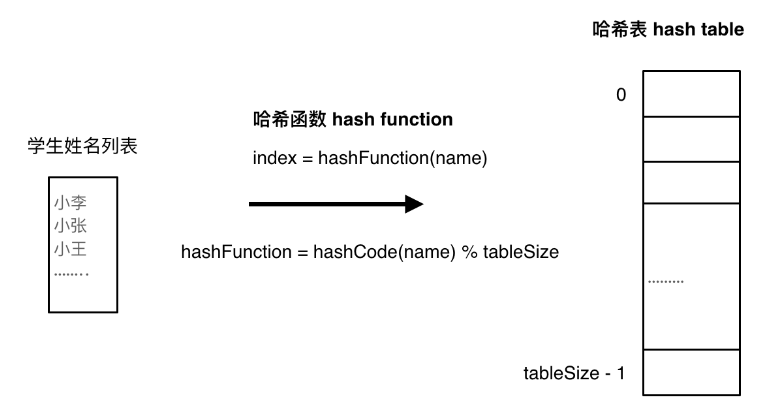
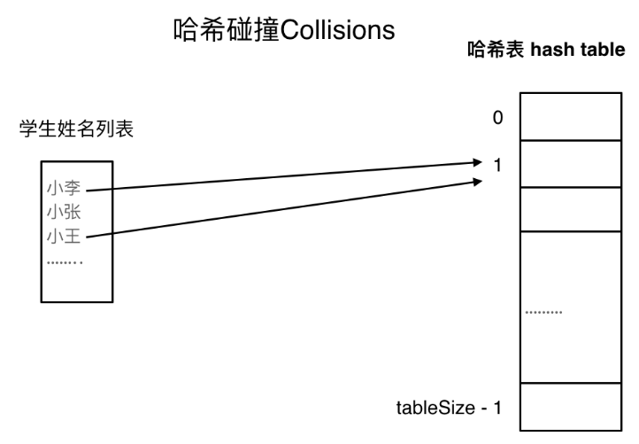
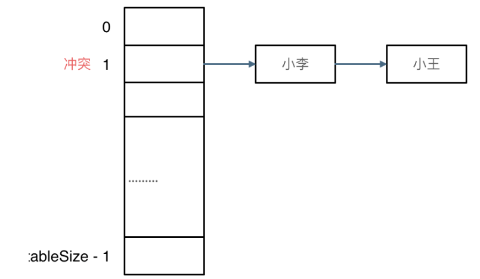
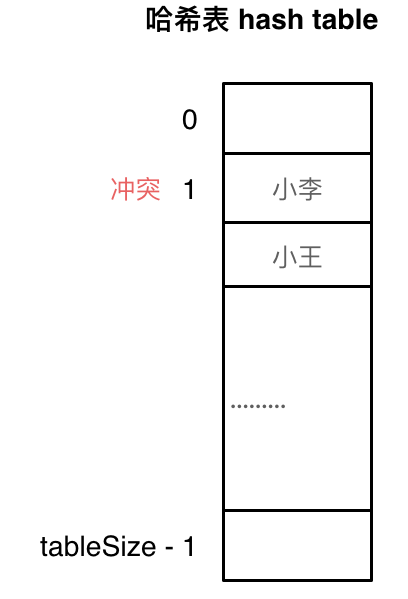

# 哈希

## 基本概念

### 1 哈希函数




### 2 哈希碰撞

不同key值映射到相同的哈希表的索引中，**这一现象叫做哈希碰撞。**



==解决方法：==

- 拉链法

  - 冲突元素存储在链表中

    

- 线性试探法

  - tablesize >> datasize
  - 冲突元素向下寻找空位

  

### 3 STL hashTable实现方式

| 集合               | 底层实现 | 是否有序 | 数值是否可以重复 | 能否更改数值 | 查询效率 | 增删效率 |
| ------------------ | -------- | -------- | ---------------- | ------------ | -------- | -------- |
| std::multiset      | 红黑树   | 有序     | 是               | 否           | O(logn)  | O(logn)  |
| std::set           | 红黑树   | 有序     | 否               | 否           | O(log n) | O(log n) |
| std::unordered_set | 哈希表   | 无序     | 否               | 否           | **O(1)** | **O(1)** |


`std::unordered_set`底层实现为哈希表，``std::set` 和`std::multiset` 的底层实现是红黑树，红黑树是一种平衡二叉搜索树，所以key值是有序的，但key不可以修改，改动key值会导致整棵树的错乱，所以只能删除和增加。

| 映射               | 底层实现 | 是否有序 | 数值是否可以重复 | 能否更改数值 | 查询效率 | 增删效率 |
| ------------------ | -------- | -------- | ---------------- | ------------ | -------- | -------- |
| std::map           | 红黑树   | key有序  | key不可重复      | key不可修改  | O(logn)  | O(logn)  |
| std::multimap      | 红黑树   | key有序  | key可重复        | key不可修改  | O(log n) | O(log n) |
| std::unordered_map | 哈希表   | key无序  | key不可重复      | key不可修改  | **O(1)** | **O(1)** |

std::unordered_map 底层实现为哈希表，std::map 和std::multimap 的底层实现是红黑树。同理，std::map 和std::multimap 的key也是有序的（这个问题也经常作为面试题，考察对语言容器底层的理解）。


### 4 **总结：**

总结一下，**当我们遇到了要快速判断一个元素是否出现集合里的时候，就要考虑哈希法**。

但是哈希法也是**牺牲了空间换取了时间**，因为我们要使用额外的数组，set或者是map来存放数据，才能实现快速的查找。

如果在做面试题目的时候遇到需要判断一个元素是否出现过的场景也应该第一时间想到哈希法！


## 242 有效的字母异位词

**题目：**

给定两个字符串 *`s`* 和 *`t`* ，编写一个函数来判断 *`t`*  是否是  *`s`* 的字母异位词。

**注意：**若 *`s`* 和  *`t`*  中每个字符出现的次数都相同，则称 *`s`* 和 *`t`* 互为字母异位词。

**提示：**

- `1 <= s.length, t.length <= 5 * 104`
- `s` 和 `t` 仅包含小写字母

**思路：**

- 暴力双循环，记录字符串中字符出现次数
- 哈希表，记录字符串字符出现次数

> 一般要查询某元素是否在集合中时，第一时间采用哈希法


解法：哈希表

- 集合长度较短，先采取数组方式构建哈希表
- 将所有字符映射到哈希表中，即`char - 'a' = i ` 

- 统计两个字符串字符出现次数
  - 为节省空空间，只需前一个字符串字符数++，后一个字符串字符数--

```cpp
class Solution {
public:
    bool isAnagram(string s, string t) {
        int hash[26] = {0};//用数组初始化哈希表
        for (int i = 0; i < s.size(); i++) {
            //当两个字符做减法，编辑器自动将字符转换成对应的ASCII码
            hash[s[i] - 'a']++;//统计字符s[i]出现的次数，若出现hash[s[i]]++
        }
        for (int i = 0; i < t.size(); i++) {
            hash[t[i] - 'a']--;//统计字符t[i]在t中出现的次数，若出现，hash--
        }

        // 当此时hash表中所有元素为0时，证明两个字符串为字母异位词
        for (int i = 0; i < 26; i++) {
            if (hash[i] != 0) return false;
        }

        return true;

    }
};

```


## 349 两个数组的交集

**题目：**

给定两个数组 `nums1` 和 `nums2` ，返回 *它们的交集* 。输出结果中的每个元素一定是 **唯一** 的。我们可以 **不考虑输出结果的顺序** 。

**提示：**

- `1 <= nums1.length, nums2.length <= 1000`
- `0 <= nums1[i], nums2[i] <= 1000`

**思路：**

- 数组作为哈希表
- `set`作为哈希表

解法一：数组作为哈希表

- 首先要初始化数组的哈希表，哈希表长度为数组内元素的最大值
- 将数组`nums1`映射到哈希表
- 遍历`nums2`中元素，找对应的哈希表，若哈希表的值不为0，则表明该值为交集元素，将该值插入到结果vector中
  - 可以用**unordered_set**作为结果类型，==自动去重交集元素==

```cpp
class Solution {
public:
    vector<int> intersection(vector<int>& s, vector<int>& t) {
        unordered_set<int> result_set;//结果保存集合
        int  num_hash[1001] = {0};//数组初始化哈希表全为0，哈希表长度对应输入数组的元素值的最大返回

        for (int i = 0; i < s.size(); i++) {
            num_hash[s[i]] = 1;//将第一个数组映射到哈希表中，出现则哈希表中值为1
        }

        for (int i = 0; i < t.size(); i++) {
            if (num_hash[t[i]] == 1) {//查找对应数组2在哈希表中的对应值，若值==1，意味此值是与数组1的交集元素
                result_set.insert(t[i]);
            }
        }
        return vector<int> (result_set.begin(), result_set.end());//将unordered_set结果类型转换成vector输出

    }
};
```

解法二：set构建哈希表

- set作为哈希表
  - 优点：查找效率O(1)，增删效率O(1)
  - 缺点：空间复杂度高
- 其他过程与数组类似

```cpp
class Solution {
public:
    vector<int> intersection(vector<int>& s, vector<int>& t) {
        unordered_set<int> result_set;
        unordered_set<int> num_set(s.begin(), s.end());//将数组1映射到哈希表中中

        for (int i = 0; i < t.size(); i++) {
            if (num_set.find(t[i]) != num_set.end()) {//在哈希表中查找数组2元素，若存在，则该值为交集元素，放入结果集合中
                result_set.insert(t[i]);
            }
        }
        return vector<int> (result_set.begin(), result_set.end());//将unordered_set结果类型转换成vector输出

    }
};
```


## 202 快乐数

**题目：**

编写一个算法来判断一个数 `n` 是不是快乐数。

**「快乐数」** 定义为：

- 对于一个正整数，每一次将该数替换为它每个位置上的数字的平方和。
- 然后重复这个过程直到这个数变为 1，也可能是==**无限循环**== 但始终变不到 1。

- 如果这个过程 **结果为** 1，那么这个数就是快乐数。

如果 `n` 是 *快乐数* 就返回 `true` ；不是，则返回 `false` 。

**提示：**

- `1 <= n <= 231 - 1`

**思路：**

- 关键点在于无限循环，即sum可能会重复
- sum存在哈希表中，若sum重复，则n不是快乐数
- 当sum=1时，n为快乐数

```cpp
class Solution {
public:
    //向下取余法求每位数
    int getSum(int n) {
        int sum = 0;
        while(n>0) {
            int cur = n%10;//个位数
            n /= 10;
            sum += cur*cur;
        }
        return sum;
    }
    
    bool isHappy(int n) {
        int sum = 0;
        unordered_set<int> result;

        while (1) {//一直求sum，直到出现循环或者找到快乐数
            sum = getSum(n);//不断求sum
            if ( sum == 1 ) return true;//若sum=1，则n为快乐数，立即退出

            if (result.find(sum) != result.end()) {//若sum发生循环，即重复出现在哈希表中，则n不是快乐数，立即退出
                return false;
            }
            else result.insert(sum);//否则，将未出现的sum保存到哈希表中
            n = sum;//重新赋值n，继续求和
        }    
    }
    
};

```


## 1 两数之和

**题目：**

给定一个整数数组 `nums` 和一个整数目标值 `target`，请你在该数组中找出 **和为目标值** *`target`* 的那 **两个** 整数，并返回它们的数组下标。

你可以假设每种输入只会对应一个答案。但是，数组中同一个元素在答案里不能重复出现。

你可以按任意顺序返回答案。

**提示：**

- `2 <= nums.length <= 104`
- `-109 <= nums[i] <= 109`
- `-109 <= target <= 109`
- **只会存在一个有效答案**

**思路：**

- 暴力求解，两层循环找等于target的元素a和元素b
- 哈希表法，保存访问过的元素，找与target相差的匹配对元素

解法一：暴力求解：

过程就不写了，大概就是双层循环，然后return {i, j}


解法二：哈希表法

- 由于不仅需要查找元素，还要查找元素下标，因此用map最为方便
- map中存放的是访问过的元素，且其中元素无法构成与target的匹配对( 即$a+b=target$)
- map的作用是查找下一个元素的匹配对，若存在匹配对，立即返回，否则，遍历结束返回空数组

```cpp

class Solution {
public:
    vector<int> twoSum(vector<int>& nums, int target) {
        
        unordered_map<int, int> num_hash;

        for (int i = 0; i < nums.size(); i++) {
            int s = target - nums[i];//在哈希表中找是否存在匹配的s，与nums[i]构成target
            if (num_hash.find(s) != num_hash.end()) {
                //若找到了s，则立即返回两个数的下标
                return {num_hash.find(s)->second, i};
            }
            num_hash.insert(pair<int, int> (nums[i], i));//s不在哈希表中，则立即插入遍历过的元素nums[i]
        }
        return {};
    }
};
```

**重点：**

本题其实有四个重点：

- 为什么会想到用哈希表
  - 要在数组中找元素，即用哈希表来查找效率最高
- 哈希表为什么用map
  - 不仅要查找元素，又要查找元素下标，set和vector只能存一个值，map可以存放键值对
- 本题map是用来存什么的
  - map存以访问过的元素，从而在下一个元素来查找之前的元素是否有与之匹配的元素，二者只和=target
- map中的key和value用来存什么的
  - key存元素，value存下标，这是因为计算过程中要的是元素值，而最终返回的是元素下标

## 454 四数相加II

**题目:**

给你四个整数数组 `nums1`、`nums2`、`nums3` 和 `nums4` ，数组长度都是 `n` ，请你计算有多少个元组 `(i, j, k, l)` 能满足：

- `0 <= i, j, k, l < n`
- `nums1[i] + nums2[j] + nums3[k] + nums4[l] == 0`

**提示：**

- `n == nums1.length`

- `n == nums2.length`
- `n == nums3.length`
- `n == nums4.length`

- `1 <= n <= 200`
- `-228 <= nums1[i], nums2[i], nums3[i], nums4[i] <= 228`

**思路：**

- 暴力迭代，四层循环逐个寻找，count++，时间复杂度$O(n^4)$
- 构建哈希表，将多个数组分2组求和，将其中一组放入哈希表，查询另一组数组和

解法二：哈希表查找法

- 根据题意，需要再四个数组中查找四个元素之和为0，故首先想到哈希表来查找
- 由于需要考虑重复元素之和为0的情况，因此考虑用map来构建哈希表，key放一组数组之和，value为数组之和的重复次数
- 如何对多个数组分组，需要考虑时间复杂度情况，4个数组22分组，时间复杂度为$2*O(n^2)$，而11分组时间复杂度为$O(n^3)$，因此考虑22分组

```cpp
class Solution {
public:
    int fourSumCount(vector<int>& A, vector<int>& B, vector<int>& C, vector<int>& D) {
        unordered_map<int, int> hash_sum;
        int count = 0;
        //第一次循环统计前两个数组
        for(int a: A) {
            for (int b: B) {
                hash_sum[a+b]++;//将ab之和存放在哈希表中，key为其和，value为出现的次数
            }
        }

        //第二次循环，查找后两个数组之和
        for (int c: C) {
            for (int d: D) {
                if (hash_sum.find(0 - (c+d)) != hash_sum.end() ) {
                    count += hash_sum[0-(c+d)];
                }
            }
        }

        return count ;

    }
};
```

